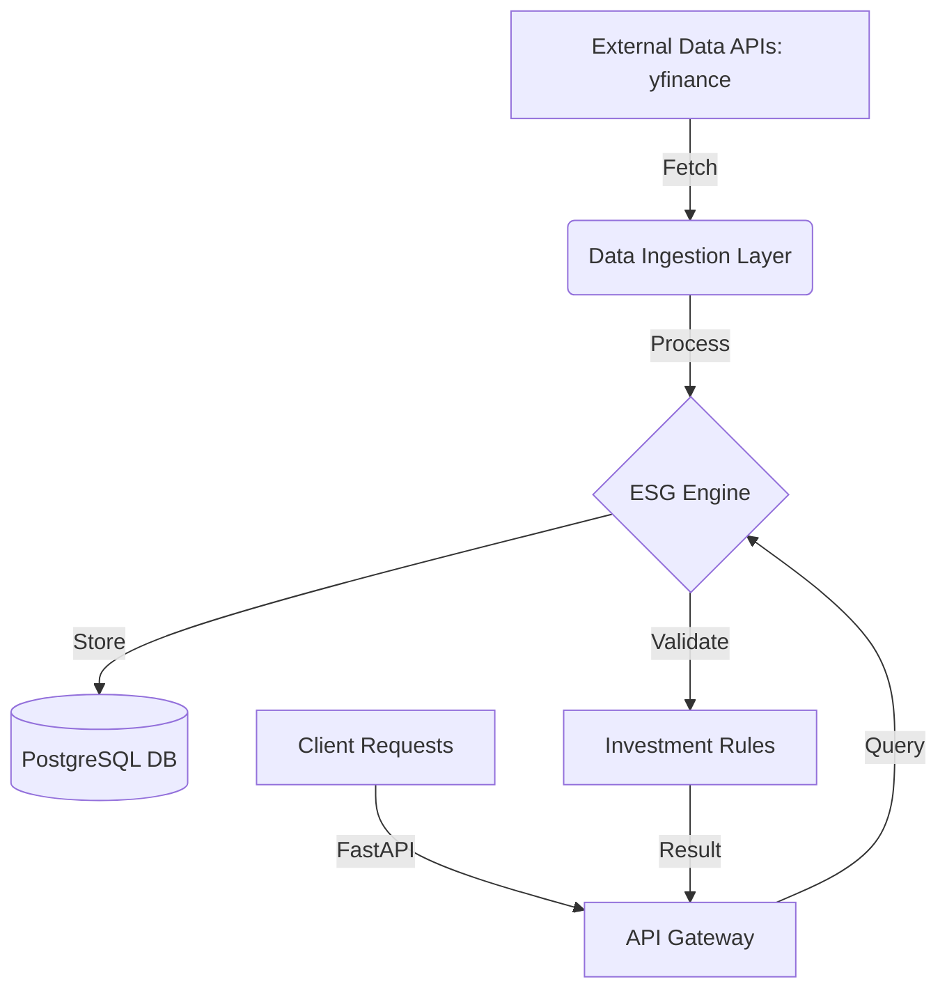

# 🌿 GreenLedger: ESG Portfolio Engine

[](https://www.python.org/downloads/)
[](https://fastapi.tiangolo.com/)
[](https://www.sqlalchemy.org/)
[](https://opensource.org/licenses/MIT)

**GreenLedger** is a high-performance ESG (Environmental, Social, and Governance) portfolio engine designed to help institutional and retail investors align their capital with their values. By integrating real-time market data with proprietary and third-party ESG metrics, GreenLedger empowers users to build, monitor, and optimize portfolios that meet strict sustainability criteria.

---

## 🏗️ System Architecture

GreenLedger is built on a modern, asynchronous micro-architecture designed for scalability and data integrity.



- **API Layer**: Powered by FastAPI for high-throughput, asynchronous request handling.
- **ORM & Migrations**: SQLAlchemy 2.0 with Alembic for robust schema management and type-safe queries.
- **Data Processing**: Pandas for efficient transformation of financial and ESG datasets.
- **Infrastructure**: Containerized using Docker for reproducible development and deployment environments.

---

## 🔥 Key Capabilities

- **📊 Real-time Portfolio Health**: Track holdings across multiple accounts with automated balance updates.
- **🌱 Proprietary ESG Scoring**: Custom engine that aggregates Carbon and Labor scores to provide a holistic view of sustainability.
- **🛡️ Rule Enforcement**: Define and enforce granulated investment rules (e.g., "Min Carbon Score > 70") at the account level.

---

## 🛠️ Tech Stack & Standards

We employ industry-best practices to ensure code quality and system reliability:

- **Runtime**: Python 3.13+ (Utilizing the latest performance optimizations).
- **Package Management**: `uv` - The next-generation Python package installer and resolver.
- **Database**: PostgreSQL 17 (Optimized for complex financial queries).
- **API Framework**: FastAPI (Pydantic v2 for rigorous data validation).

---

## 🚀 Getting Started

### Prerequisites

- [Docker & Docker Compose](https://docs.docker.com/get-docker/)
- [uv](https://github.com/astral-sh/uv) (Recommended for local dev)

### Quick Start

1.  **Clone the repository**:

    ```bash
    git clone https://github.com/JoeArias1121/GreenLedger.git
    cd GreenLedger
    ```

2.  **Environment Setup**:

    ```bash
    cp .env.example .env  # Update with your DB credentials
    ```

3.  **Spin up the Infrastructure**:

    ```bash
    docker-compose up -d
    ```

4.  **Run Migrations & Seed Data**:

    ```bash
    uv run alembic upgrade head
    uv run python scripts/seed_db.py
    ```

5.  **Start the API Server**:
    ```bash
    uv run uvicorn app.main:app --reload
    ```

---

## 🧪 ESG Methodology

GreenLedger derives sustainability metrics using a weighted average of:

1.  **Environmental (Carbon Score)**: Tracks Scope 1-3 emissions data.
2.  **Social (Labor Score)**: Monitors workforce diversity, safety, and fair compensation.

Portfolios are evaluated by calculating the weighted average of holdings against the `InvestmentRule` set for each specific account.

---

## 🛣️ Roadmap

- [ ] Interactive Frontend
